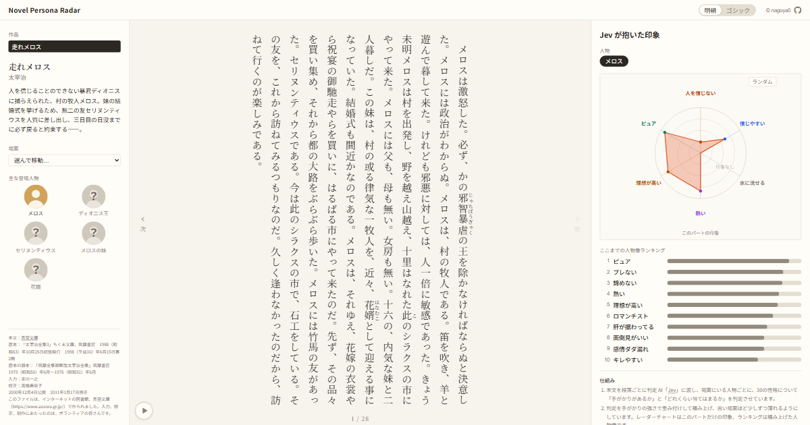
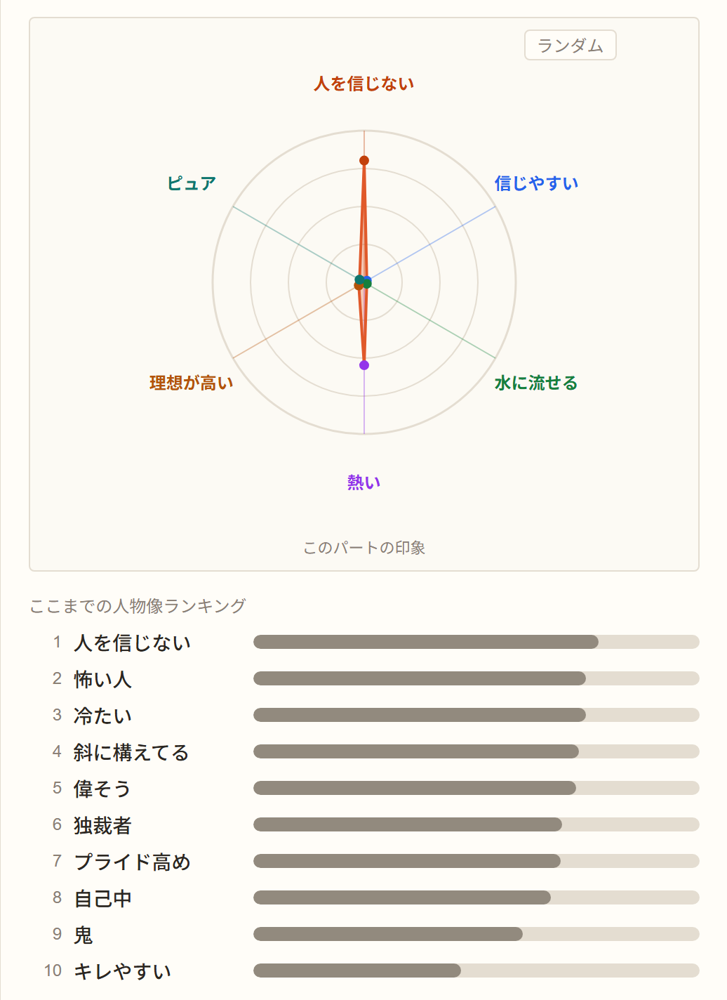
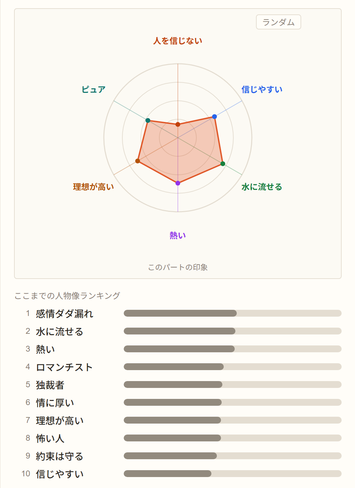
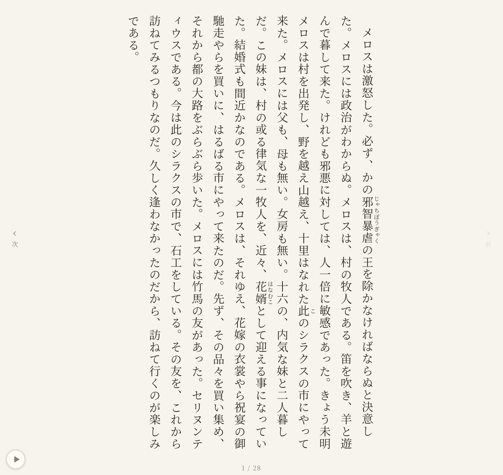
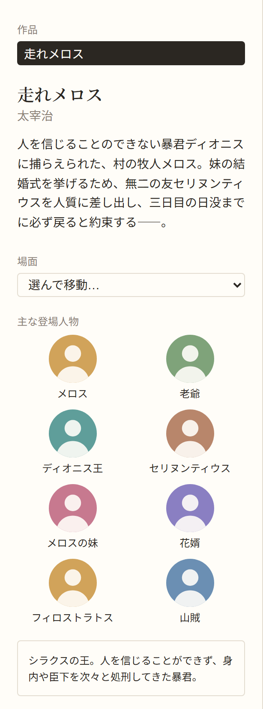

# Novel Persona Radar

Read a novel and watch its characters take shape.

A reader for public-domain Japanese novels from [Aozora Bunko](https://www.aozora.gr.jp/). As you
turn the pages, an AI judge reads each paragraph and the page shows the impression each character
leaves: a radar for the page in front of you, and a ranking of traits for the story so far. In
Dazai Osamu's *Run, Melos!* (走れメロス), the tyrant king's ranking starts with *scary*,
*dictator* and *distrustful*, and in the last pages *forgiving* and *warm-hearted* climb past
them.

Try the **[demo page](https://novel-persona-radar.vercel.app/)** on a desktop browser.

<a href="public/og-image.png"></a>

## What you see

Three columns: the work, the text, and the impression the characters leave
([ADR 0013](docs/adr/0013-three-column-layout.md)). The impression is the point, so it comes first
here.

### The impression

For the chosen character, a **radar** of the current page and a **ranking** of the traits
accumulated up to it. The king of *Run, Melos!* on page 5, where he scoffs at Melos's promise to
come back, and on the last page, after his change of heart:

<table>
  <tr>
    <td><a href="docs/images/analysis-early.png"></a></td>
    <td><a href="docs/images/analysis-late.png"></a></td>
  </tr>
  <tr>
    <td align="center">The king, page 5</td>
    <td align="center">The king, page 28</td>
  </tr>
</table>

- The radar has six axes, each picked from a dictionary of 30 traits (or all redrawn at random).
  An axis the page says nothing about reads 印象なし, "no impression", instead of a value.
- The ranking shows the ten strongest traits so far. Bars grow and rows slide to their new ranks
  as you turn the page.
- Trait labels are casual Japanese words (*ブレない*, *水に流せる*) rather than psychology terms.

### The text

<a href="docs/images/text-column.png"></a>

Vertical Japanese text with ruby, one page (about 400 characters) at a time, the font fitted so
that a page never scrolls.

### The work

<a href="docs/images/work-column.png"></a>

A summary, a scene picker to jump to key moments, and the main characters. A character appears
greyed out with a "？" when first mentioned, and in colour once they step on stage; pointing at
one shows their introduction below the list, without spoilers.

### Controls

See [ADR 0039](docs/adr/0039-reading-controls.md) and [ADR 0041](docs/adr/0041-autoplay-button.md).

| Control | What it does |
|---|---|
| 次 / 前 side buttons, ← / → keys | Next and previous page (← is next, as in vertical text) |
| Bottom margin of the text | Hover to reveal a page bar; click or drag to jump |
| ▶ button, bottom left | Autoplay: turns pages at 3 seconds per line of text; the ring shows the wait |
| 明朝 / ゴシック switch in the header | Mincho or Gothic typeface |
| `?part=12&character=king` | Deep link to a page (1-based) with a character selected |

Motion follows the operating system's reduce-motion setting.

## Demo

Open the **[demo page](https://novel-persona-radar.vercel.app/)** — designed for desktop browsers
at least 1280 pixels wide; narrow screens show a screenshot instead.

For example, [the last page of *Run, Melos!* with the king selected](https://novel-persona-radar.vercel.app/works/run-melos?part=28&character=king).

## How it works

```
Aozora Bunko XHTML ─┐
annotation.json ────┼─▶ pnpm judge ─▶ Jev ─▶ judgments.jsonl ─┐
trait dictionary ───┘                                          ├─▶ build ─▶ static site
                                                               │           (accumulates in
source + annotation ───────────────────────────────────────────┘            the browser)
```

1. **Annotation.** Each work has an annotation file: the characters and their names, and per
   paragraph who is on stage, who is only mentioned, and whose voice it is (narration, speech or
   thoughts). It is drafted by an AI (Claude) and reviewed by hand. The source file is pinned by
   its SHA-256 hash, so the paragraphs cannot drift from the annotation.
2. **Judging.** [Jev](https://typesafe.ai), a model that answers typed questions rather than
   writing prose, reads one paragraph at a time and, for every character on stage, answers two
   questions per trait:
   - *Does this paragraph give any evidence about whether the character is suspicious?* — 0 to 1
   - *Judging from this paragraph, how suspicious is the character?* — a five-level score
3. **Accumulation.** Code, not the model, builds the profile: each score is weighted by its
   evidence, and older judgments fade by a factor of 0.85 with each new paragraph the character is
   on stage in, so that characters can change. This runs in the browser from the stored judgments; the page never calls an AI.

Some choices behind this:

- **Two questions instead of one.** Asked how *suspicious* a character is in a paragraph that says
  nothing about it, a model still answers with a number. Weighting by a separate evidence question
  keeps that noise out ([ADR 0003](docs/adr/0003-evidence-and-score.md)).
- **Fresh eyes on every paragraph.** Jev sees the current paragraph and the annotation, not the
  paragraphs before it: passing earlier text let its evidence leak into later judgments
  ([ADR 0030](docs/adr/0030-annotated-cast-instead-of-previous-paragraphs.md)).
- **Only characters on stage are judged**, so a character's profile reflects what they do and say,
  not what others say about them ([ADR 0032](docs/adr/0032-on-stage-profiles-and-two-first-appearances.md)).
- **The trait dictionary was chosen by screening.** 100 candidate traits from Patrick Gunkel's
  *Ideonomy* were judged over the whole story, and 30 were kept for spread across characters and
  movement over time ([ADR 0035](docs/adr/0035-trait-dictionary-from-screening.md)).

### Numbers for *Run, Melos!*

74 paragraphs, 8 judged characters, 30 traits: 152 requests of 60 questions each, about 670
thousand input tokens, about US$0.03. Judging the story twice gave the same results to within
0.01 on evidence and 0.05 on scores on average. Details in [docs/judging.md](docs/judging.md).

## Running it

Requires Node.js 24 and pnpm.

```sh
pnpm install
pnpm dev        # compile data/ and start the dev server
pnpm build      # static export to out/
pnpm test       # unit tests (Vitest)
```

The judgments are committed, so none of the above needs an API key. To judge a work again:

```sh
pnpm judge run-melos --dry-run   # print the first request, send nothing
TYPESAFE_API_KEY=… pnpm judge run-melos
```

Judging only sends the requests that are not stored yet, so an interrupted run resumes where it
stopped. It costs money; see the numbers above.

## Stack

- **Site:** Next.js (App Router, static export), React, TypeScript, Tailwind CSS, d3-scale and
  d3-shape for the radar, Motion for animation.
- **Pipeline:** TypeScript scripts run with tsx; a small `fetch`-based Jev client with retries.
- **Tests:** Vitest.

## Repository layout

```
data/works/<id>/     source XHTML, annotation.json, judgments.jsonl
data/traits/         trait candidates and the 30-trait dictionary
scripts/             judge.ts, build-data.ts and their shared code
src/core/            pure TypeScript: parts, profile, reveal, request building
src/components/      the page
docs/adr/            design decisions
docs/ideas.md        ideas and open questions
```

Design decisions are recorded as Architecture Decision Records in [docs/adr](docs/adr/).

## Credits

- Text: 太宰治「走れメロス」, from [Aozora Bunko](https://www.aozora.gr.jp/cards/000035/files/1567_14913.html);
  input by 金川一之, proofreading by 高橋美奈子. The full credits are shown on the page.
- Trait words: Patrick Gunkel, [Ideonomy: "Personality Traits"](https://ideonomy.mit.edu/essays/traits.html).
- Judging model: [Jev](https://typesafe.ai) by TypeSafe AI.
